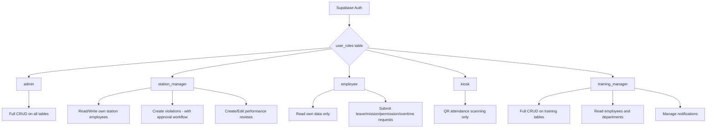

# HR System — Supabase Architecture

> **Last Updated:** 2026-03-08  
> **Database:** PostgreSQL via Lovable Cloud (Supabase)  
> **Project ID:** `iygkzkglrkdrmuyeuiht`

---

## Table of Contents

1. [Overview](#overview)
2. [Enums](#enums)
3. [Entity Relationship Diagram](#entity-relationship-diagram)
4. [Role-Based Access Model](#role-based-access-model)
5. [Core Tables](#core-tables)
6. [Module Tables](#module-tables)
7. [Views](#views)
8. [Database Functions](#database-functions)
9. [Triggers](#triggers)
10. [Indexes](#indexes)
11. [Unique Constraints](#unique-constraints)
12. [RLS Policy Summary](#rls-policy-summary)
13. [Edge Functions](#edge-functions)
14. [Realtime Publications](#realtime-publications)
15. [Secrets](#secrets)
16. [Migration Guide — Recreate from Scratch](#migration-guide--recreate-from-scratch)

---

## Overview

This document describes the **complete** Postgres schema, RLS policies, functions, triggers, indexes, and edge functions for the HR management system. The system supports five roles: **admin**, **station_manager**, **employee**, **kiosk**, and **training_manager**, all enforced via Row-Level Security.

**Total Tables:** 35 (33 base tables + 1 view + profiles)  
**All tables have RLS enabled.**

---

## Enums

```sql
CREATE TYPE public.app_role AS ENUM ('admin', 'station_manager', 'employee', 'kiosk', 'training_manager');
CREATE TYPE public.employee_status AS ENUM ('active', 'inactive', 'suspended');
```

---

## Entity Relationship Diagram

```mermaid
erDiagram
    auth_users ||--o| profiles : "1:1 (FK cascade)"
    auth_users ||--o{ user_roles : "1:N (FK cascade)"
    profiles ||--o| employees : "linked via user_id"
    
    stations ||--o{ employees : "1:N"
    departments ||--o{ employees : "1:N"
    stations ||--o{ user_roles : "station_managers"
    stations ||--o{ qr_locations : "1:N"
    
    employees ||--o{ attendance_records : "1:N"
    employees ||--o{ attendance_events : "1:N"
    employees ||--o{ salary_records : "1:N"
    employees ||--o{ payroll_entries : "1:N"
    employees ||--o{ loans : "1:N"
    employees ||--o{ advances : "1:N"
    employees ||--o{ loan_installments : "1:N (via loan)"
    employees ||--o{ performance_reviews : "1:N"
    employees ||--o{ training_records : "1:N"
    employees ||--o{ training_acknowledgments : "1:N"
    employees ||--o{ training_debts : "1:N"
    employees ||--o{ missions : "1:N"
    employees ||--o{ violations : "1:N"
    employees ||--o{ mobile_bills : "1:N"
    employees ||--o{ leave_requests : "1:N"
    employees ||--o{ leave_balances : "1:N"
    employees ||--o{ permission_requests : "1:N"
    employees ||--o{ overtime_requests : "1:N"
    employees ||--o{ uniforms : "1:N"
    employees ||--o{ employee_documents : "1:N"
    employees ||--o{ notifications : "1:N"
    employees ||--o{ planned_course_assignments : "1:N"

    loans ||--o{ loan_installments : "1:N (FK cascade)"
    training_courses ||--o{ training_records : "1:N"
    training_courses ||--o{ planned_courses : "1:N (optional)"
    planned_courses ||--o{ planned_course_assignments : "1:N"
    training_records ||--o{ training_acknowledgments : "1:N"
    
    user_roles ||--o| employees : "FK set null"
    permission_profiles ||--o{ user_module_permissions : "profile_id"
    
    departments ||--o{ notifications : "department_id"
    stations ||--o{ notifications : "station_id"
```



---

## Role-Based Access Model



---

## Core Tables

### 1. `stations`
| Column | Type | Nullable | Default | Notes |
|--------|------|----------|---------|-------|
| id | uuid PK | NO | gen_random_uuid() | |
| code | text UNIQUE | NO | | e.g. 'cairo', 'alex' |
| name_ar | text | NO | | |
| name_en | text | NO | | |
| timezone | text | NO | 'Africa/Cairo' | |
| is_active | boolean | NO | true | |
| created_at | timestamptz | NO | now() | |

**FK:** None  
**RLS:** Admin full CRUD; Authenticated read; Training manager read

### 2. `departments`
| Column | Type | Nullable | Default | Notes |
|--------|------|----------|---------|-------|
| id | uuid PK | NO | gen_random_uuid() | |
| name_ar | text | NO | | |
| name_en | text | NO | | |
| is_active | boolean | NO | true | |
| created_at | timestamptz | NO | now() | |

**FK:** None  
**RLS:** Admin full CRUD; Authenticated read; Training manager read

### 3. `profiles`
Mirrors `auth.users` for queryable user data. Auto-created by trigger on auth.users INSERT.

| Column | Type | Nullable | Default | Notes |
|--------|------|----------|---------|-------|
| id | uuid PK | NO | | = auth.users.id |
| email | text | YES | | |
| full_name | text | YES | | |
| avatar_url | text | YES | | |
| created_at | timestamptz | NO | now() | |

**FK:** `profiles.id → auth.users(id) ON DELETE CASCADE`  
**RLS:** Self-read, self-update; Admin read all; **No INSERT/DELETE from client**

### 4. `user_roles`
| Column | Type | Nullable | Default | Notes |
|--------|------|----------|---------|-------|
| id | uuid PK | NO | gen_random_uuid() | |
| user_id | uuid | NO | | FK auth.users(id) CASCADE |
| role | app_role | NO | | admin, station_manager, employee, kiosk, training_manager |
| station_id | uuid | YES | | FK stations(id), for station_manager |
| employee_id | uuid | YES | | FK employees(id) SET NULL, for employee role |

**UNIQUE:** (user_id, role)  
**RLS:** Admin full CRUD; Users read own roles

### 5. `user_module_permissions`
| Column | Type | Nullable | Default | Notes |
|--------|------|----------|---------|-------|
| id | uuid PK | NO | gen_random_uuid() | |
| user_id | uuid UNIQUE | NO | | |
| profile_id | uuid | YES | | FK permission_profiles |
| custom_modules | jsonb | YES | | |
| created_at | timestamptz | NO | now() | |

**RLS:** Admin full CRUD; Users read own permissions

### 6. `permission_profiles`
| Column | Type | Nullable | Default | Notes |
|--------|------|----------|---------|-------|
| id | uuid PK | NO | gen_random_uuid() | |
| name_ar | text | NO | | |
| name_en | text | NO | | |
| description_ar | text | YES | | |
| description_en | text | YES | | |
| modules | jsonb | NO | '[]' | Array of module access definitions |
| is_system | boolean | NO | false | |
| created_at | timestamptz | NO | now() | |

**RLS:** Admin full CRUD; Authenticated read

### 7. `user_devices`
| Column | Type | Nullable | Default | Notes |
|--------|------|----------|---------|-------|
| id | uuid PK | NO | gen_random_uuid() | |
| user_id | uuid | NO | | |
| device_id | text UNIQUE | NO | | Device fingerprint |
| bound_at | timestamptz | NO | now() | |

**RLS:** Admin full CRUD; Users read own device

### 8. `device_alerts`
| Column | Type | Nullable | Default | Notes |
|--------|------|----------|---------|-------|
| id | uuid PK | NO | gen_random_uuid() | |
| user_id | uuid | NO | | |
| device_id | text | NO | | |
| reason | text | NO | | |
| meta | jsonb | YES | | |
| triggered_at | timestamptz | NO | now() | |

**RLS:** Admin full CRUD only

---

## Module Tables

### 9. `employees`
| Column | Type | Nullable | Default | Notes |
|--------|------|----------|---------|-------|
| id | uuid PK | NO | gen_random_uuid() | |
| user_id | uuid | YES | | FK auth.users SET NULL |
| employee_code | text UNIQUE | NO | | e.g. 'Emp001' |
| name_ar | text | NO | | |
| name_en | text | NO | | |
| station_id | uuid | YES | | FK stations(id) |
| department_id | uuid | YES | | FK departments(id) |
| job_title_ar | text | YES | '' | |
| job_title_en | text | YES | '' | |
| phone | text | YES | '' | |
| email | text | YES | '' | |
| status | employee_status | NO | 'active' | |
| hire_date | date | YES | | |
| birth_date | date | YES | | |
| gender | text | YES | | |
| national_id | text | YES | | |
| basic_salary | numeric | YES | 0 | |
| bank_name | text | YES | | |
| bank_account_number | text | YES | | |
| bank_id_number | text | YES | | |
| bank_account_type | text | YES | | |
| contract_type | text | YES | | |
| first_name | text | YES | | |
| father_name | text | YES | | |
| family_name | text | YES | | |
| birth_place | text | YES | | |
| birth_governorate | text | YES | | |
| religion | text | YES | | |
| nationality | text | YES | | |
| marital_status | text | YES | | |
| children_count | integer | YES | 0 | |
| education_ar | text | YES | | |
| graduation_year | text | YES | | |
| home_phone | text | YES | | |
| address | text | YES | | |
| city | text | YES | | |
| governorate | text | YES | | |
| id_issue_date | date | YES | | |
| id_expiry_date | date | YES | | |
| issuing_authority | text | YES | | |
| issuing_governorate | text | YES | | |
| military_status | text | YES | | |
| dept_code | text | YES | | |
| job_level | text | YES | | |
| job_degree | text | YES | | |
| recruited_by | text | YES | | |
| employment_status | text | YES | 'active' | |
| resignation_date | date | YES | | |
| resignation_reason | text | YES | | |
| resigned | boolean | YES | false | |
| social_insurance_no | text | YES | | |
| social_insurance_start_date | date | YES | | |
| social_insurance_end_date | date | YES | | |
| health_insurance_card_no | text | YES | | |
| has_health_insurance | boolean | YES | false | |
| has_gov_health_insurance | boolean | YES | false | |
| has_social_insurance | boolean | YES | false | |
| has_cairo_airport_temp_permit | boolean | YES | false | |
| has_cairo_airport_annual_permit | boolean | YES | false | |
| has_airports_temp_permit | boolean | YES | false | |
| has_airports_annual_permit | boolean | YES | false | |
| temp_permit_no | text | YES | | |
| annual_permit_no | text | YES | | |
| airports_temp_permit_no | text | YES | | |
| airports_annual_permit_no | text | YES | | |
| airports_permit_type | text | YES | | |
| permit_name_en | text | YES | | |
| permit_name_ar | text | YES | | |
| has_qualification_cert | boolean | YES | false | |
| has_military_service_cert | boolean | YES | false | |
| has_birth_cert | boolean | YES | false | |
| has_id_copy | boolean | YES | false | |
| has_pledge | boolean | YES | false | |
| has_contract | boolean | YES | false | |
| has_receipt | boolean | YES | false | |
| attachments | text | YES | | |
| annual_leave_balance | numeric | YES | 21 | |
| sick_leave_balance | numeric | YES | 7 | |
| avatar | text | YES | | |
| notes | text | YES | | |
| emergency_contact_name1 | text | YES | | |
| emergency_contact_mobile1 | text | YES | | |
| emergency_contact_name2 | text | YES | | |
| emergency_contact_mobile2 | text | YES | | |
| created_at | timestamptz | NO | now() | |
| updated_at | timestamptz | NO | now() | Auto-updated by trigger |

**RLS:** Admin full CRUD; Station manager read own station; Employee read own record; Training manager read all

### 10. `attendance_records`
| Column | Type | Nullable | Default | Notes |
|--------|------|----------|---------|-------|
| id | uuid PK | NO | gen_random_uuid() | |
| employee_id | uuid | NO | | FK employees CASCADE |
| date | date | NO | | |
| check_in | timestamptz | YES | | |
| check_out | timestamptz | YES | | |
| work_hours | numeric | YES | 0 | Computed by trigger |
| work_minutes | integer | YES | 0 | Computed by trigger |
| status | text | NO | 'present' | present, absent, late, mission |
| is_late | boolean | YES | false | |
| notes | text | YES | | |
| created_at | timestamptz | NO | now() | |

**RLS:** Admin full; Employee read/insert/update own; Station manager read/insert own station

### 11. `attendance_events`
QR-based attendance scan events.

| Column | Type | Nullable | Default | Notes |
|--------|------|----------|---------|-------|
| id | uuid PK | NO | gen_random_uuid() | |
| user_id | uuid | NO | | Scanning user |
| employee_id | uuid | YES | | FK employees |
| event_type | text | NO | | check_in / check_out |
| scan_time | timestamptz | NO | now() | |
| token_ts | timestamptz | NO | | QR token timestamp |
| device_id | text | NO | | |
| location_id | uuid | YES | | FK qr_locations |
| gps_lat | double precision | YES | | |
| gps_lng | double precision | YES | | |

**RLS:** Admin full; Users read own events

### 12. `qr_locations`
| Column | Type | Nullable | Default | Notes |
|--------|------|----------|---------|-------|
| id | uuid PK | NO | gen_random_uuid() | |
| name_ar | text | NO | | |
| name_en | text | NO | | |
| station_id | uuid | YES | | FK stations |
| latitude | double precision | YES | | |
| longitude | double precision | YES | | |
| radius_m | integer | YES | 150 | Geofence radius |
| is_active | boolean | NO | true | |
| created_at | timestamptz | NO | now() | |

**RLS:** Admin full CRUD; Authenticated read active locations

### 13. `salary_records`
Annual salary structure per employee.

| Column | Type | Nullable | Default | Notes |
|--------|------|----------|---------|-------|
| id | uuid PK | NO | gen_random_uuid() | |
| employee_id | uuid | NO | | FK employees CASCADE |
| year | text | NO | | |
| basic_salary | numeric | YES | 0 | |
| transport_allowance | numeric | YES | 0 | |
| incentives | numeric | YES | 0 | |
| living_allowance | numeric | YES | 0 | |
| station_allowance | numeric | YES | 0 | |
| mobile_allowance | numeric | YES | 0 | |
| employee_insurance | numeric | YES | 0 | |
| employer_social_insurance | numeric | YES | 0 | |
| health_insurance | numeric | YES | 0 | |
| income_tax | numeric | YES | 0 | |
| created_at | timestamptz | NO | now() | |

**UNIQUE:** (employee_id, year)  
**RLS:** Admin full; Employee read own

### 14. `payroll_entries`
Monthly processed payroll.

| Column | Type | Nullable | Default | Notes |
|--------|------|----------|---------|-------|
| id | uuid PK | NO | gen_random_uuid() | |
| employee_id | uuid | NO | | FK employees CASCADE |
| month | text | NO | | '01'–'12' |
| year | text | NO | | |
| basic_salary | numeric | YES | 0 | |
| transport_allowance | numeric | YES | 0 | |
| incentives | numeric | YES | 0 | |
| station_allowance | numeric | YES | 0 | |
| mobile_allowance | numeric | YES | 0 | |
| living_allowance | numeric | YES | 0 | |
| overtime_pay | numeric | YES | 0 | |
| bonus_type | text | YES | 'amount' | |
| bonus_value | numeric | YES | 0 | |
| bonus_amount | numeric | YES | 0 | Computed by trigger |
| gross | numeric | YES | 0 | Computed by trigger |
| employee_insurance | numeric | YES | 0 | |
| employer_social_insurance | numeric | YES | 0 | |
| health_insurance | numeric | YES | 0 | |
| income_tax | numeric | YES | 0 | |
| loan_payment | numeric | YES | 0 | |
| advance_amount | numeric | YES | 0 | |
| mobile_bill | numeric | YES | 0 | |
| leave_days | numeric | YES | 0 | |
| leave_deduction | numeric | YES | 0 | Computed by trigger |
| penalty_type | text | YES | 'amount' | |
| penalty_value | numeric | YES | 0 | |
| penalty_amount | numeric | YES | 0 | Computed by trigger |
| total_deductions | numeric | YES | 0 | Computed by trigger |
| net_salary | numeric | YES | 0 | Computed by trigger |
| processed_at | timestamptz | NO | now() | |

**UNIQUE:** (employee_id, month, year)  
**RLS:** Admin full; Employee read own

### 15. `loans`
| Column | Type | Nullable | Default | Notes |
|--------|------|----------|---------|-------|
| id | uuid PK | NO | gen_random_uuid() | |
| employee_id | uuid | NO | | FK employees CASCADE |
| amount | numeric | NO | | |
| monthly_installment | numeric | YES | 0 | Computed by trigger |
| installments_count | integer | NO | 1 | |
| paid_count | integer | YES | 0 | |
| remaining | numeric | YES | 0 | |
| status | text | NO | 'active' | active, completed, defaulted |
| start_date | date | NO | CURRENT_DATE | |
| reason | text | YES | | |
| created_at | timestamptz | NO | now() | |

**RLS:** Admin full; Employee read own

### 16. `loan_installments`
Auto-generated by trigger on loan creation.

| Column | Type | Nullable | Default | Notes |
|--------|------|----------|---------|-------|
| id | uuid PK | NO | gen_random_uuid() | |
| loan_id | uuid | NO | | FK loans CASCADE |
| employee_id | uuid | NO | | FK employees CASCADE |
| installment_number | integer | NO | | |
| amount | numeric | NO | | |
| due_date | date | NO | | |
| status | text | NO | 'pending' | pending, paid, overdue |
| paid_at | timestamptz | YES | | |
| created_at | timestamptz | NO | now() | |

**RLS:** Admin full; Employee read own

### 17. `advances`
| Column | Type | Nullable | Default | Notes |
|--------|------|----------|---------|-------|
| id | uuid PK | NO | gen_random_uuid() | |
| employee_id | uuid | NO | | FK employees CASCADE |
| amount | numeric | NO | | |
| deduction_month | text | NO | | YYYY-MM |
| status | text | NO | 'pending' | pending, approved, deducted |
| reason | text | YES | | |
| created_at | timestamptz | NO | now() | |

**RLS:** Admin full; Employee read own

### 18. `performance_reviews`
| Column | Type | Nullable | Default | Notes |
|--------|------|----------|---------|-------|
| id | uuid PK | NO | gen_random_uuid() | |
| employee_id | uuid | NO | | FK employees CASCADE |
| reviewer_id | uuid | YES | | FK auth.users |
| quarter | text | NO | | Q1-Q4 |
| year | text | NO | | |
| score | numeric | YES | 0 | Computed from criteria |
| status | text | NO | 'draft' | draft, submitted, approved |
| criteria | jsonb | YES | '[]' | [{name, score, weight}] |
| strengths | text | YES | | |
| improvements | text | YES | | |
| goals | text | YES | | |
| manager_comments | text | YES | | |
| review_date | date | YES | CURRENT_DATE | |
| created_at | timestamptz | NO | now() | |

**RLS:** Admin full; Employee read own; Station manager full for own station

### 19. `training_courses`
| Column | Type | Nullable | Default | Notes |
|--------|------|----------|---------|-------|
| id | uuid PK | NO | gen_random_uuid() | |
| name_ar | text | NO | | |
| name_en | text | NO | | |
| course_code | text | YES | '' | |
| description | text | YES | | |
| duration_hours | integer | YES | 0 | |
| course_duration | text | YES | '' | |
| course_objective | text | YES | '' | |
| basic_topics | text | YES | '' | |
| intermediate_topics | text | YES | '' | |
| advanced_topics | text | YES | '' | |
| exercises | text | YES | '' | |
| examination | text | YES | '' | |
| reference_material | text | YES | '' | |
| course_administration | text | YES | '' | |
| provider | text | YES | '' | |
| edited_by | text | YES | '' | |
| validity_years | integer | YES | 1 | |
| is_active | boolean | YES | true | |
| created_at | timestamptz | NO | now() | |

**RLS:** Admin full CRUD; Authenticated read; Training manager full CRUD

### 20. `training_records`
| Column | Type | Nullable | Default | Notes |
|--------|------|----------|---------|-------|
| id | uuid PK | NO | gen_random_uuid() | |
| employee_id | uuid | NO | | FK employees CASCADE |
| course_id | uuid | YES | | FK training_courses |
| status | text | NO | 'enrolled' | enrolled, completed, cancelled |
| start_date | date | YES | | |
| end_date | date | YES | | |
| planned_date | date | YES | | Auto-calculated |
| score | numeric | YES | | |
| cost | numeric | YES | 0 | |
| total_cost | numeric | YES | 0 | |
| provider | text | YES | | |
| location | text | YES | | |
| has_cert | boolean | YES | false | |
| has_cr | boolean | YES | false | |
| is_favorite | boolean | YES | false | |
| created_at | timestamptz | NO | now() | |

**RLS:** Admin full; Employee read own; Training manager full CRUD

### 21. `training_acknowledgments`
| Column | Type | Nullable | Default | Notes |
|--------|------|----------|---------|-------|
| id | uuid PK | NO | gen_random_uuid() | |
| training_record_id | uuid | NO | | FK training_records |
| employee_id | uuid | NO | | FK employees |
| acknowledged_at | timestamptz | NO | now() | |

**UNIQUE:** (training_record_id, employee_id)  
**RLS:** Admin full; Employee insert/read own; Training manager full CRUD

### 22. `training_debts`
| Column | Type | Nullable | Default | Notes |
|--------|------|----------|---------|-------|
| id | uuid PK | NO | gen_random_uuid() | |
| employee_id | uuid | NO | | FK employees |
| course_name | text | NO | | |
| cost | numeric | NO | 0 | |
| actual_date | date | NO | | |
| expiry_date | date | NO | | |
| created_at | timestamptz | NO | now() | |

**RLS:** Admin full; Employee read own; Training manager full CRUD

### 23. `planned_courses`
| Column | Type | Nullable | Default | Notes |
|--------|------|----------|---------|-------|
| id | uuid PK | NO | gen_random_uuid() | |
| course_id | uuid | YES | | FK training_courses |
| course_code | text | NO | '' | |
| course_name | text | NO | '' | |
| planned_date | date | YES | | |
| duration | text | YES | '' | |
| location | text | YES | '' | |
| trainer | text | YES | '' | |
| provider | text | YES | '' | |
| participants | integer | YES | 0 | |
| cost | numeric | YES | 0 | |
| status | text | NO | 'scheduled' | |
| created_at | timestamptz | NO | now() | |

**RLS:** Admin full CRUD; Authenticated read; Training manager full CRUD

### 24. `planned_course_assignments`
| Column | Type | Nullable | Default | Notes |
|--------|------|----------|---------|-------|
| id | uuid PK | NO | gen_random_uuid() | |
| planned_course_id | uuid | NO | | FK planned_courses |
| employee_id | uuid | NO | | FK employees |
| actual_date | date | YES | | |
| created_at | timestamptz | NO | now() | |

**UNIQUE:** (planned_course_id, employee_id)  
**RLS:** Admin full CRUD; Authenticated read; Training manager full CRUD

### 25. `missions`
| Column | Type | Nullable | Default | Notes |
|--------|------|----------|---------|-------|
| id | uuid PK | NO | gen_random_uuid() | |
| employee_id | uuid | NO | | FK employees CASCADE |
| mission_type | text | NO | 'full_day' | morning, evening, full_day |
| destination | text | YES | | |
| reason | text | YES | | |
| date | date | NO | | |
| check_in | time | YES | | Auto-set by type |
| check_out | time | YES | | Auto-set by type |
| hours | numeric | YES | 0 | |
| status | text | NO | 'pending' | pending, approved, rejected |
| approved_by | uuid | YES | | FK auth.users |
| created_at | timestamptz | NO | now() | |

**RLS:** Admin full; Employee insert/read own

### 26. `violations`
| Column | Type | Nullable | Default | Notes |
|--------|------|----------|---------|-------|
| id | uuid PK | NO | gen_random_uuid() | |
| employee_id | uuid | NO | | FK employees CASCADE |
| created_by | uuid | YES | | FK auth.users |
| type | text | NO | | |
| description | text | YES | | |
| penalty | text | YES | | |
| date | date | NO | CURRENT_DATE | |
| status | text | NO | 'pending' | pending, active, resolved |
| approved_by | uuid | YES | | FK auth.users |
| approved_at | timestamptz | YES | | |
| created_at | timestamptz | NO | now() | |

**RLS:** Admin full; Employee read own; Station manager full for own station

### 27. `mobile_bills`
| Column | Type | Nullable | Default | Notes |
|--------|------|----------|---------|-------|
| id | uuid PK | NO | gen_random_uuid() | |
| employee_id | uuid | NO | | FK employees CASCADE |
| amount | numeric | NO | 0 | |
| deduction_month | text | NO | | YYYY-MM |
| status | text | NO | 'pending' | pending, deducted |
| uploaded_by | uuid | YES | | FK auth.users |
| created_at | timestamptz | NO | now() | |

**UNIQUE:** (employee_id, deduction_month) — supports upsert  
**RLS:** Admin full; Employee read own

### 28. `leave_requests`
| Column | Type | Nullable | Default | Notes |
|--------|------|----------|---------|-------|
| id | uuid PK | NO | gen_random_uuid() | |
| employee_id | uuid | NO | | FK employees CASCADE |
| leave_type | text | NO | | annual, sick, casual, emergency, unpaid |
| start_date | date | NO | | |
| end_date | date | NO | | |
| days | integer | NO | 1 | |
| reason | text | YES | | |
| status | text | NO | 'pending' | pending, approved, rejected |
| approved_by | uuid | YES | | FK auth.users |
| rejection_reason | text | YES | | |
| created_at | timestamptz | NO | now() | |

**RLS:** Admin full; Employee insert/read own

### 29. `leave_balances`
| Column | Type | Nullable | Default | Notes |
|--------|------|----------|---------|-------|
| id | uuid PK | NO | gen_random_uuid() | |
| employee_id | uuid | NO | | FK employees |
| year | integer | NO | | |
| annual_total | numeric | NO | 21 | |
| annual_used | numeric | NO | 0 | |
| sick_total | numeric | NO | 15 | |
| sick_used | numeric | NO | 0 | |
| casual_total | numeric | NO | 7 | |
| casual_used | numeric | NO | 0 | |
| permissions_total | numeric | NO | 24 | |
| permissions_used | numeric | NO | 0 | |
| created_at | timestamptz | NO | now() | |

**UNIQUE:** (employee_id, year)  
**RLS:** Admin full; Employee read own

### 30. `permission_requests`
| Column | Type | Nullable | Default | Notes |
|--------|------|----------|---------|-------|
| id | uuid PK | NO | gen_random_uuid() | |
| employee_id | uuid | NO | | FK employees CASCADE |
| permission_type | text | NO | | |
| date | date | NO | | |
| start_time | time | NO | | |
| end_time | time | NO | | |
| hours | numeric | YES | 0 | |
| reason | text | YES | | |
| status | text | NO | 'pending' | |
| created_at | timestamptz | NO | now() | |

**RLS:** Admin full; Employee insert/read own

### 31. `overtime_requests`
| Column | Type | Nullable | Default | Notes |
|--------|------|----------|---------|-------|
| id | uuid PK | NO | gen_random_uuid() | |
| employee_id | uuid | NO | | FK employees CASCADE |
| date | date | NO | | |
| hours | numeric | NO | 0 | |
| overtime_type | text | NO | 'regular' | regular, holiday, etc. |
| reason | text | YES | | |
| status | text | NO | 'pending' | |
| created_at | timestamptz | NO | now() | |

**RLS:** Admin full; Employee insert/read own

### 32. `uniforms`
| Column | Type | Nullable | Default | Notes |
|--------|------|----------|---------|-------|
| id | uuid PK | NO | gen_random_uuid() | |
| employee_id | uuid | NO | | FK employees CASCADE |
| type_ar | text | NO | | |
| type_en | text | NO | | |
| quantity | integer | NO | 1 | |
| unit_price | numeric | YES | 0 | |
| total_price | numeric | YES | 0 | Computed by trigger |
| delivery_date | date | NO | | |
| notes | text | YES | | |
| created_at | timestamptz | NO | now() | |

**RLS:** Admin full; Employee read own

### 33. `employee_documents`
| Column | Type | Nullable | Default | Notes |
|--------|------|----------|---------|-------|
| id | uuid PK | NO | gen_random_uuid() | |
| employee_id | uuid | NO | | FK employees CASCADE |
| name | text | NO | | |
| type | text | YES | | |
| file_url | text | YES | | |
| uploaded_at | timestamptz | NO | now() | |

**RLS:** Admin full; Employee read own

### 34. `notifications`
| Column | Type | Nullable | Default | Notes |
|--------|------|----------|---------|-------|
| id | uuid PK | NO | gen_random_uuid() | |
| user_id | uuid | YES | | FK auth.users |
| employee_id | uuid | YES | | FK employees |
| department_id | uuid | YES | | FK departments |
| station_id | uuid | YES | | FK stations |
| title_ar | text | NO | | |
| title_en | text | NO | | |
| desc_ar | text | YES | | |
| desc_en | text | YES | | |
| type | text | NO | 'info' | success, warning, info, error |
| module | text | NO | 'general' | |
| target_type | text | YES | 'general' | general, department, station, individual |
| sender_name | text | YES | | |
| is_read | boolean | NO | false | |
| created_at | timestamptz | NO | now() | |

**RLS:** Admin full; Training manager full; User read/update own

### 35. `assets`
| Column | Type | Nullable | Default | Notes |
|--------|------|----------|---------|-------|
| id | uuid PK | NO | gen_random_uuid() | |
| asset_code | text UNIQUE | NO | | |
| name_ar | text | NO | | |
| name_en | text | NO | | |
| category | text | NO | 'other' | |
| brand | text | YES | | |
| model | text | YES | | |
| serial_number | text | YES | | |
| purchase_date | date | YES | | |
| purchase_price | numeric | YES | 0 | |
| status | text | NO | 'available' | available, assigned, maintenance, retired |
| condition | text | YES | 'good' | |
| location | text | YES | | |
| assigned_to | uuid | YES | | FK employees |
| notes | text | YES | | |
| created_at | timestamptz | NO | now() | |

**RLS:** Admin full CRUD; Authenticated read

---

## Views

### `employee_limited_view`
Restricted view of employees for station managers — excludes sensitive data (salary, national ID, bank details, insurance).

```sql
SELECT id, employee_code, name_ar, name_en, first_name, father_name, family_name,
       station_id, department_id, dept_code, job_title_ar, job_title_en, job_level,
       job_degree, phone, email, gender, status, hire_date, contract_type,
       employment_status, resigned, resignation_date, avatar, user_id, created_at, updated_at
FROM employees;
```

**No RLS on view** — access controlled via the querying role's policies on `employees`.

---

## Database Functions

| Function | Type | Purpose |
|----------|------|---------|
| `handle_new_user()` | SECURITY DEFINER | Creates profile on auth.users INSERT |
| `has_role(_user_id uuid, _role app_role)` | SECURITY DEFINER, STABLE | Check role without RLS recursion |
| `get_user_station_id(_user_id uuid)` | SECURITY DEFINER, STABLE | Get station_id for station_manager |
| `get_user_employee_id(_user_id uuid)` | SECURITY DEFINER, STABLE | Get employee_id for employee |
| `update_updated_at()` | SECURITY DEFINER | Sets updated_at = now() |
| `calculate_work_hours()` | SECURITY DEFINER | Computes work_hours/work_minutes from check_in/check_out |
| `generate_loan_installments()` | SECURITY DEFINER | Auto-generates loan_installments rows |
| `calculate_payroll_net()` | SECURITY DEFINER | Computes gross, deductions, net_salary |
| `auto_attendance_on_mission()` | SECURITY DEFINER | Creates attendance record on mission approval |
| `update_leave_balance_on_approval()` | SECURITY DEFINER | Deducts/restores leave balance on approval/un-approval |
| `update_annual_balance_on_overtime_approval()` | SECURITY DEFINER | Adds/removes 1 annual leave day on overtime approval |
| `prevent_permission_on_leave_day()` | SECURITY DEFINER | Blocks permission request on leave day |
| `upsert_mobile_bill(...)` | SECURITY DEFINER, RPC | Upserts mobile bill by employee+month |
| `calculate_uniform_total()` | SECURITY DEFINER | Computes total_price = quantity × unit_price |

---

## Triggers

| Trigger | Table | Event | Function |
|---------|-------|-------|----------|
| `trg_employees_updated_at` | employees | BEFORE UPDATE | `update_updated_at()` |
| `trg_calc_work_hours` | attendance_records | BEFORE INSERT/UPDATE | `calculate_work_hours()` |
| `trg_calc_payroll` | payroll_entries | BEFORE INSERT/UPDATE | `calculate_payroll_net()` |
| `trg_generate_loan_installments` | loans | BEFORE INSERT | `generate_loan_installments()` |
| `trg_generate_installments` | loans | AFTER INSERT | `generate_loan_installments()` ⚠️ duplicate |
| `trg_auto_attendance_mission` | missions | AFTER UPDATE | `auto_attendance_on_mission()` |
| `trg_update_leave_balance` | leave_requests | AFTER UPDATE | `update_leave_balance_on_approval()` |
| `trg_update_leave_balance_insert` | leave_requests | AFTER INSERT | `update_leave_balance_on_approval()` |
| `trg_prevent_permission_on_leave_day` | permission_requests | BEFORE INSERT | `prevent_permission_on_leave_day()` |
| `trg_calc_uniform_total` | uniforms | BEFORE INSERT/UPDATE | `calculate_uniform_total()` |
| `trg_update_annual_balance_on_overtime` | overtime_requests | AFTER UPDATE | `update_annual_balance_on_overtime_approval()` |

> ⚠️ Note: `loans` table has 2 triggers calling the same function — `trg_generate_loan_installments` and `trg_generate_installments`. Consider removing one to avoid double installment generation.

---

## Indexes

| Table | Index | Type | Columns |
|-------|-------|------|---------|
| advances | idx_advances_emp | btree | employee_id |
| assets | idx_assets_assigned | btree | assigned_to |
| assets | idx_assets_status | btree | status |
| attendance_events | idx_attendance_events_user_time | btree | user_id, scan_time DESC |
| attendance_events | idx_attendance_events_employee | btree | employee_id, scan_time DESC |
| attendance_records | idx_attendance_emp | btree | employee_id |
| attendance_records | idx_attendance_employee_date | btree | employee_id, date |
| attendance_records | idx_attendance_emp_date | btree | employee_id, date ⚠️ duplicate |
| attendance_records | idx_attendance_status | btree | status |
| attendance_records | idx_attendance_date | btree | date |
| employee_documents | idx_documents_employee | btree | employee_id |
| employees | idx_emp_status / idx_employees_status | btree | status ⚠️ duplicate |
| employees | idx_employees_code | btree | employee_code |
| employees | idx_employees_department / idx_emp_dept | btree | department_id ⚠️ duplicate |
| employees | idx_employees_station / idx_emp_station | btree | station_id ⚠️ duplicate |
| employees | idx_emp_user | btree | user_id |
| leave_requests | idx_leave_emp / idx_leaves_employee | btree | employee_id ⚠️ duplicate |
| leave_requests | idx_leave_status / idx_leaves_status | btree | status ⚠️ duplicate |
| loan_installments | idx_installments_status | btree | status |
| loan_installments | idx_installments_due | btree | due_date |
| loan_installments | idx_installments_loan | btree | loan_id |
| loan_installments | idx_installments_employee | btree | employee_id |
| loans | idx_loans_employee | btree | employee_id |

> ⚠️ Several duplicate indexes exist. Consider cleanup in a future migration.

---

## Unique Constraints

| Table | Constraint | Columns |
|-------|-----------|---------|
| stations | uq_station_code, stations_code_key | (code) ⚠️ duplicate |
| employees | uq_employee_code, employees_employee_code_key | (employee_code) ⚠️ duplicate |
| salary_records | salary_records_employee_id_year_key, uq_salary_emp_year | (employee_id, year) ⚠️ duplicate |
| payroll_entries | payroll_entries_employee_id_month_year_key, uq_payroll_emp_month_year | (employee_id, month, year) ⚠️ duplicate |
| mobile_bills | uq_mobile_bill_emp_month, mobile_bills_employee_id_deduction_month_key | (employee_id, deduction_month) ⚠️ duplicate |
| assets | assets_asset_code_key | (asset_code) |
| leave_balances | leave_balances_employee_id_year_key | (employee_id, year) |
| planned_course_assignments | planned_course_assignments_planned_course_id_employee_id_key | (planned_course_id, employee_id) |
| user_module_permissions | user_module_permissions_user_id_key | (user_id) |
| user_devices | user_devices_device_id_key | (device_id) |
| user_roles | user_roles_user_id_role_key | (user_id, role) |
| training_acknowledgments | training_acknowledgments_training_record_id_employee_id_key | (training_record_id, employee_id) |

---

## RLS Policy Summary

All 35 tables have RLS **enabled**. Policy pattern:

| Role | Access Pattern |
|------|---------------|
| **Admin** | `has_role(auth.uid(), 'admin')` → Full CRUD on all tables |
| **Station Manager** | `has_role(auth.uid(), 'station_manager') AND employee.station_id = get_user_station_id(auth.uid())` → Scoped to own station for employees, attendance, violations, performance |
| **Employee** | `has_role(auth.uid(), 'employee') AND employee_id = get_user_employee_id(auth.uid())` → Own data only |
| **Kiosk** | Uses `attendance_events` via edge function (service role) |
| **Training Manager** | `has_role(auth.uid(), 'training_manager')` → Full CRUD on training tables (courses, records, acknowledgments, debts, planned courses, assignments); Read employees/departments/stations; Manage notifications |

---

## Edge Functions

| Function | JWT Verify | Purpose |
|----------|-----------|---------|
| `setup-user` | false | Create users with roles (first admin bootstrapping or admin-only) |
| `generate-qr-token` | false | Generate HMAC-signed QR tokens for attendance |
| `submit-scan` | false | Process QR attendance scan, validate device, geofence, create attendance record |
| `delete-user` | true | Delete user and all associated records |
| `send-notification` | true | Send targeted notifications to users/departments/stations |

---

## Realtime Publications

No tables are currently published to `supabase_realtime`.

---

## Secrets

| Name | Purpose |
|------|---------|
| LOVABLE_API_KEY | Lovable AI integration |
| QR_HMAC_SECRET | HMAC signing for QR attendance tokens |
| SUPABASE_URL | Auto-configured |
| SUPABASE_ANON_KEY | Auto-configured |
| SUPABASE_SERVICE_ROLE_KEY | Auto-configured |
| SUPABASE_DB_URL | Auto-configured |
| SUPABASE_PUBLISHABLE_KEY | Auto-configured |

---

## Migration Guide — Recreate from Scratch

If you need to recreate this database from scratch on a new Supabase project, use the full SQL dump in `db-dump.md`. Run the SQL scripts **in order**:

1. **Create Enums** — `app_role` (5 values), `employee_status`
2. **Create Core Tables** — stations, departments, profiles, employees, user_roles, permission_profiles, user_module_permissions, user_devices, device_alerts
3. **Create Module Tables** — All remaining tables (attendance, salary, training, leaves, etc.)
4. **Create View** — `employee_limited_view`
5. **Create Functions** — All 14 database functions
6. **Create Triggers** — All 11 triggers
7. **Create Indexes** — All performance indexes
8. **Enable RLS & Create Policies** — On all 35 tables
9. **Deploy Edge Functions** — `setup-user`, `generate-qr-token`, `submit-scan`, `delete-user`, `send-notification`
10. **Bootstrap First Admin** — via `setup-user` edge function (no auth required when no admins exist)
11. **Configure Secrets** — `QR_HMAC_SECRET`, `LOVABLE_API_KEY`

### Notes for Migration

- ⚠️ **Duplicate indexes/constraints exist** in the current DB. The migration script above removes duplicates.
- ⚠️ **Duplicate loan trigger** (`trg_generate_loan_installments` + `trg_generate_installments`). Only one is included above.
- The `handle_new_user` trigger must be created on `auth.users` — this requires elevated privileges.
- Edge functions must be deployed separately.
- No realtime publications are currently active.
- No storage buckets are currently configured.
